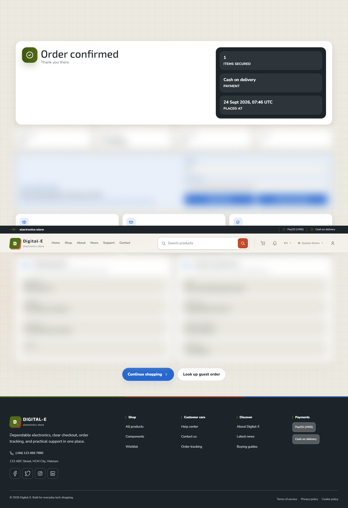
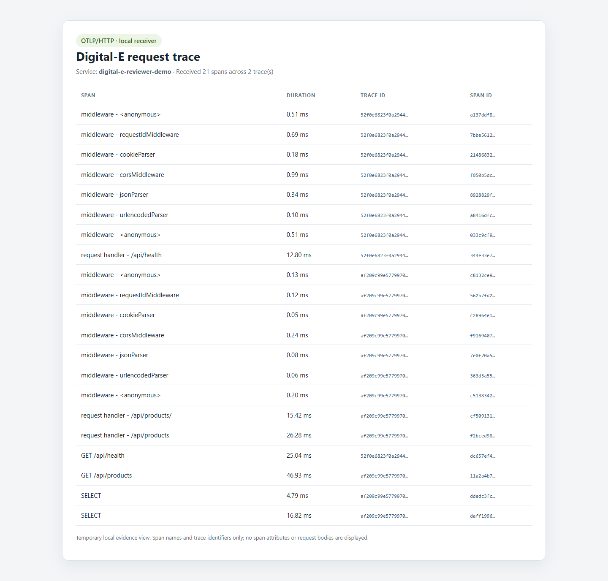

# Reviewer demo path

Use this path to follow one guest order from a seeded catalog through cash-on-delivery checkout and secure order lookup, then connect the customer outcome to the project's load and trace evidence.

## Prepare a safe local demo

Follow the [development guide](./DEVELOPMENT.md) to configure the local environment, start the disposable MySQL database, seed demo products, and run the client and API. The walkthrough uses:

- Storefront: `http://localhost:5173`
- API health: `http://localhost:4000/api/health`

Use only the disposable local database. This flow writes one COD order. Do not place demo orders against production or shared data.

## Follow the customer journey

1. Open [`/shops`](http://localhost:5173/shops) and choose an in-stock seeded product.
2. Open its details, choose a quantity, and add it to the guest cart.
3. Open [`/cart`](http://localhost:5173/cart), review the item and total, then choose **Proceed to checkout**.
4. Enter synthetic details such as `demo-reviewer@example.invalid` and a fictional address. Select **Cash on delivery** and submit once.
5. Confirm the **Order confirmed** page. Keep the order ID and guest access token private; together they grant access to the order.
6. Open [`/guest-order`](http://localhost:5173/guest-order), enter the ID and token, and verify that the order loads.

If checkout times out or its result is unclear, try guest order lookup before submitting again so you do not create a duplicate. Do not put order identifiers, tokens, or contact details in screenshots or public notes.

## Observed browser proof

Verified on 2026-09-24 in Microsoft Edge at a 1440 × 1000 desktop viewport: one in-stock Sony PlayStation 5 Slim was added to the guest cart, ordered once with COD, confirmed, and retrieved through token-protected guest lookup. The product, checkout, and lookup routes were also checked at 390 × 844; each remained 390 px wide without horizontal overflow. Playwright reported no page errors.

The screenshot keeps the confirmation visible and obscures the order summary, guest credentials, and shipping details.



## Connect the engineering evidence

| Evidence | What it demonstrates | Scope |
| --- | --- | --- |
| Real browser | Product discovery, guest cart, server-validated COD checkout, confirmation, and token-protected lookup | One synthetic order in the disposable local database |
| [k6 smoke profile](../server/test/k6-api-smoke.js) | Health and public catalog response contracts, request failures, and p95 latency | Read-only GET requests; capped at five virtual users |
| [OpenTelemetry runtime](../server/src/observability/telemetry.ts) | HTTP and Express spans, MySQL2 spans, API metrics, and trace IDs in correlated request logs | Opt-in OTLP/HTTP export to a local or approved test collector |

Run the bounded k6 smoke profile from the repository root:

```text
pnpm --dir server perf:setup
pnpm --dir server perf:smoke
```

**Observed on 2026-09-24** against the seeded local API: one virtual user for 20 seconds, 20 iterations, 121 HTTP requests, 242/242 checks passed, 0% failed requests, and 11.5 ms p95 latency. The profile thresholds are fewer than 1% failed requests, p95 below 1,200 ms, and at least 99% successful checks. It covers health, catalog listing, search, facets, product detail, and comparison when seeded data supports those paths. This low-load smoke run checks API contracts and latency; it is not a capacity benchmark or an SLO claim. See the [k6 guide](../server/test/README-k6.md) for configuration and test-target safety.

### Explore traces locally

For a disposable visual trace backend, run Grafana's [OpenTelemetry LGTM container](https://github.com/grafana/docker-otel-lgtm):

```text
docker run --rm --name digital-e-demo-otel -p 127.0.0.1:4318:4318 -p 127.0.0.1:3000:3000 grafana/otel-lgtm:0.30.1
```

In the ignored local `server/.env`, enable telemetry and restart the API:

```env
OTEL_ENABLED=true
OTEL_SERVICE_NAME=digital-e-server
OTEL_EXPORTER_OTLP_ENDPOINT=http://127.0.0.1:4318
```

Open Grafana at `http://127.0.0.1:3000` and sign in with the local image's default `admin` / `admin` credentials. Inspect the `digital-e-server` service in Tempo, and follow a catalog HTTP span into its Express and MySQL2 child spans. Match its `trace_id` to the API request log. Each browser-to-API request is traced independently; the storefront does not currently propagate one trace across the entire browser journey. The exporter removes URL query strings and masks SQL statements. Telemetry is disabled by default. See [architecture and observability details](./ARCHITECTURE.md#observability).

**Observed trace proof on 2026-09-24:** a separate compiled API process on port 4001 sent read-only health and catalog traffic against the disposable local database to a temporary loopback OTLP receiver. It exported 21 spans across two traces; three OTLP metrics requests also reached the receiver. Both request-log trace IDs matched the collector trace IDs, and the catalog trace included two masked MySQL `SELECT` spans. The checkout browser run used the already-running API with telemetry disabled, so this trace snapshot proves the server instrumentation on health/catalog requests, not the COD request itself. A reviewer can enable telemetry before running the journey to see checkout requests too.



## Source map

- [Cart and checkout UI](../client/src/features/orders/pages/CartPage.tsx) and [checkout submission](../client/src/features/orders/components/CheckoutPaymentPage.tsx)
- [Guest order lookup](../client/src/features/orders/pages/GuestOrderLookupPage.tsx)
- [k6 runner and thresholds](../server/test/k6-api-smoke.js)
- [OTel initialization and exporters](../server/src/observability/telemetry.ts)
- [Request and trace correlation](../server/src/interceptors/request-logger.interceptor.ts)
